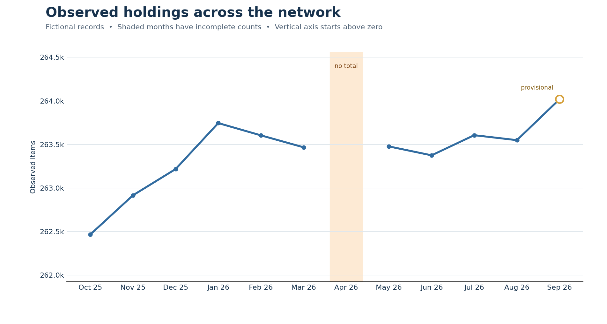
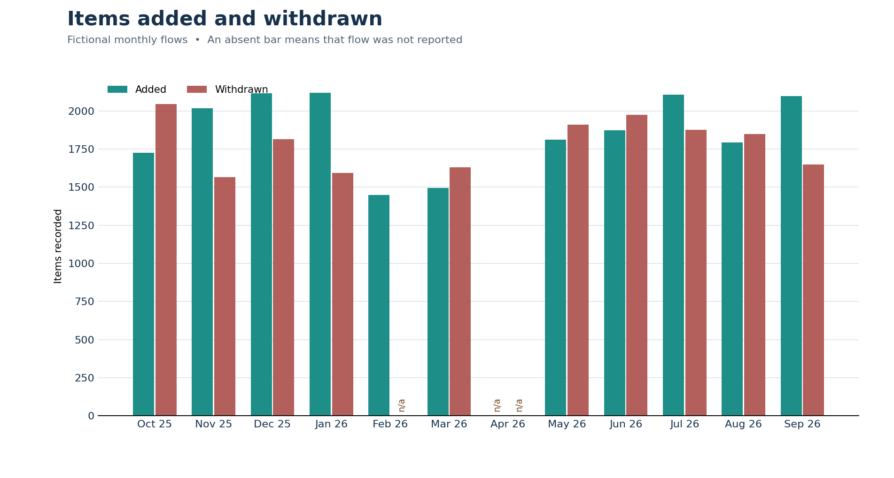

# Community Library Collection Analytics

A self-contained Python portfolio project that turns a **fictional collection-change ledger** into validated monthly statistics, four board-friendly Matplotlib charts, a concise Markdown brief, and Tableau Public-ready data for interactive storytelling.

Every community name, code, event, and count is fictional. The project begins with a new CSV ledger and can be reproduced from its sample-data generator.

## The question

How did a group of community libraries' collections change over time, and which reported counts can be presented with confidence? An observed closing count can disagree with the additions and withdrawals that supposedly produced it. A missing report is unknown, even when adjacent months are known. This example makes those differences visible.

## In the sample

- **9** fictional communities, each identified by a four-letter code;
- **4** nonoverlapping collection families;
- **12** months, October 2025 through September 2026; **432** ledger records;
- balanced transfers between communities;
- a real recorded zero for one small collection;
- an entirely missing April report for Echo Meadow, which leaves a gap in the system trend;
- an unavailable February withdrawal count whose month still has an observed closing total; and
- a **19-item** discrepancy in one September count, marked provisional.

The synthetic history is generated from a fixed seed, so the example can be recreated exactly. The figures illustrate data-handling choices and should not be interpreted as measures of real library activity.

## Sample results





The [sample board brief](output/board_brief.md) also includes [current community holdings](output/images/community-holdings.png) and [collection mix](output/images/collection-mix.png). It calls out incomplete and provisional data next to the visuals.

## Reproduce it

Python 3.10 or newer is recommended. The analysis uses Python's standard library and Matplotlib for PNG charts.

```bash
python -m venv .venv
python -m pip install -r requirements.txt
python scripts/generate_sample.py --out data/sample_ledger.csv
python src/run_analysis.py \
  --ledger data/sample_ledger.csv \
  --start 2025-10 --months 12 \
  --out output
python scripts/export_tableau.py
python -m unittest discover -s tests -v
```

On Windows PowerShell, put the analysis command on one line or use PowerShell backticks in place of the displayed Bash continuation characters. The generated example and outputs are already included, so readers can inspect the project before running anything.

The analysis writes:

| File | Purpose |
|---|---|
| `output/monthly_system.csv` | Monthly reported totals, flows, gaps, and status |
| `output/current_communities.csv` | Latest observed community totals and month-to-month change |
| `output/quality_issues.csv` | Specific missing-data, continuity, and reconciliation findings |
| `output/board_brief.md` | Short narrative with data-quality notes and four linked PNGs |
| `output/images/*.png` | Static charts suitable for a slide, packet, or README |

Use `--ledger`, `--start`, `--months`, and `--out` with another ledger of the same schema. The script validates the requested month grid and refuses duplicate keys and malformed numeric cells. The sample generator is optional for other data.

## Tableau Public companion

The `tableau/data/` folder includes four import-ready CSVs at separate, documented grains: 12 safe network-month totals, 432 community/family records, nine current community summaries, and ten quality findings. The [Tableau build guide](tableau/BUILD_GUIDE.md) explains the design and the [sheet-by-sheet workbook specification](tableau/WORKBOOK_SPEC.md) gives exact fields, calculations, dashboard structure, and checks for the [three-point story](tableau/STORYBOARD.md).

The Tableau workbook is **not yet authored or published**. These files and instructions make it possible to build and verify one in Tableau Public without altering the Python/Matplotlib pipeline. The network table leaves April's total blank; summing the detailed rows across all communities would falsely turn the missing Echo Meadow report into a partial system total. A published Tableau URL can be added after the actual workbook has been created and checked.

## Data contract

A record is one `period × community_id × collection_family`. The six numeric fields are opening count, added, withdrawn, transferred in, transferred out, and **independently observed** closing count. When all components are available, the validator checks:

```text
expected closing = opening + added - withdrawn + transferred in - transferred out
```

An empty numeric CSV field maps to Python `None` and remains unknown. `0` means a reported zero. The system total is omitted if any expected closing count is missing. Missing flow values make a change calculation unavailable while a separately observed closing count can still be plotted as provisional. Transfers in and out are checked for balance across the system.

See [the data dictionary](docs/data-dictionary.md) and [design notes](docs/design.md) for exact rules and limitations.

## Repository map

```text
community-library-collection-analytics/
├── README.md
├── LICENSE
├── LICENSE-CONTENT.md
├── requirements.txt
├── data/sample_ledger.csv
├── scripts/generate_sample.py
├── scripts/export_tableau.py
├── src/ledger.py
├── src/charts.py
├── src/run_analysis.py
├── tests/test_pipeline.py
├── docs/data-dictionary.md
├── docs/design.md
├── docs/verification.md
├── tableau/
│   ├── BUILD_GUIDE.md
│   ├── WORKBOOK_SPEC.md
│   ├── STORYBOARD.md
│   └── data/four Tableau-ready CSVs
└── output/
    ├── board_brief.md
    ├── three summary/quality CSV files
    └── images/four PNG charts
```

## License and Tableau status

The Python source code is [MIT-licensed](LICENSE). The original fictional datasets, documentation, Markdown reports, and charts are [CC BY 4.0](LICENSE-CONTENT.md). The Tableau Public workbook has not yet been created. Add a Tableau Public link only once the live viz exists and has been checked against the sample outputs.
