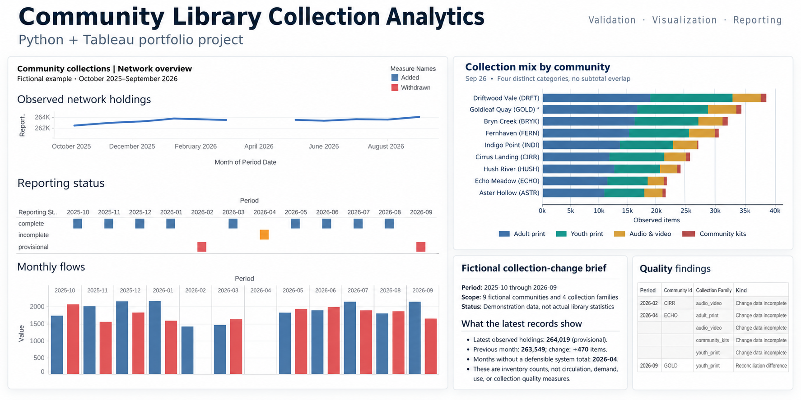

# Community Library Collection Analytics

A Python + Tableau portfolio project demonstrating **reproducible library collection analysis, data-quality validation, reporting, and interactive visualization**.

The project turns a fictional collection-change ledger into validated monthly summaries, four Matplotlib charts, a board-facing brief, and Tableau-ready data. The tracked sample covers **9 fictional communities, 4 collection families, and 12 months (432 records)**. All names, counts, and events are synthetic.

**[Explore the live Tableau Public dashboard](https://public.tableau.com/views/CommunityCollectionsNetworkOverview/Networkoverview?:language=en-US&:display_count=n&:origin=viz_share_link)** · **[Read the sample board brief](output/board_brief.md)**

## What this demonstrates

- A reproducible Python workflow from source ledger to analysis outputs.
- Explicit handling of **unknown, zero, incomplete, and provisional** data rather than silently filling gaps.
- Reconciliation and continuity checks that surface data-quality problems before reporting.
- Static Matplotlib reporting plus an interactive Tableau Public companion.
- Automated tests and documented verification of the sample pipeline.

## Quick start

Python 3.10 or newer is recommended.

```bash
python -m venv .venv
source .venv/bin/activate          # macOS / Linux
# Windows PowerShell: .\.venv\Scripts\Activate.ps1

python -m pip install -r requirements.txt
python scripts/generate_sample.py --out data/sample_ledger.csv
python src/run_analysis.py --ledger data/sample_ledger.csv --start 2025-10 --months 12 --out output
python scripts/export_tableau.py
python -m unittest discover -s tests -v
```

The generated sample data and outputs are already included, so the repository can also be explored without rerunning the pipeline.

## Go deeper

- **[Data dictionary](docs/data-dictionary.md)** — ledger schema, blank-vs-zero semantics, and deliberate quality cases.
- **[Design and validation](docs/design.md)** — workflow, reconciliation rules, missing-data behavior, and limitations.
- **[Verification](docs/verification.md)** — test coverage and clean-copy reproducibility checks.
- **[Tableau build guide](tableau/BUILD_GUIDE.md)** — how the interactive companion was assembled.
- **[Workbook specification](tableau/WORKBOOK_SPEC.md)** — fields, calculations, dashboard structure, and checks.

## License

Python source code is [MIT-licensed](LICENSE). Original fictional datasets, documentation, reports, and charts are [CC BY 4.0](LICENSE-CONTENT.md).
