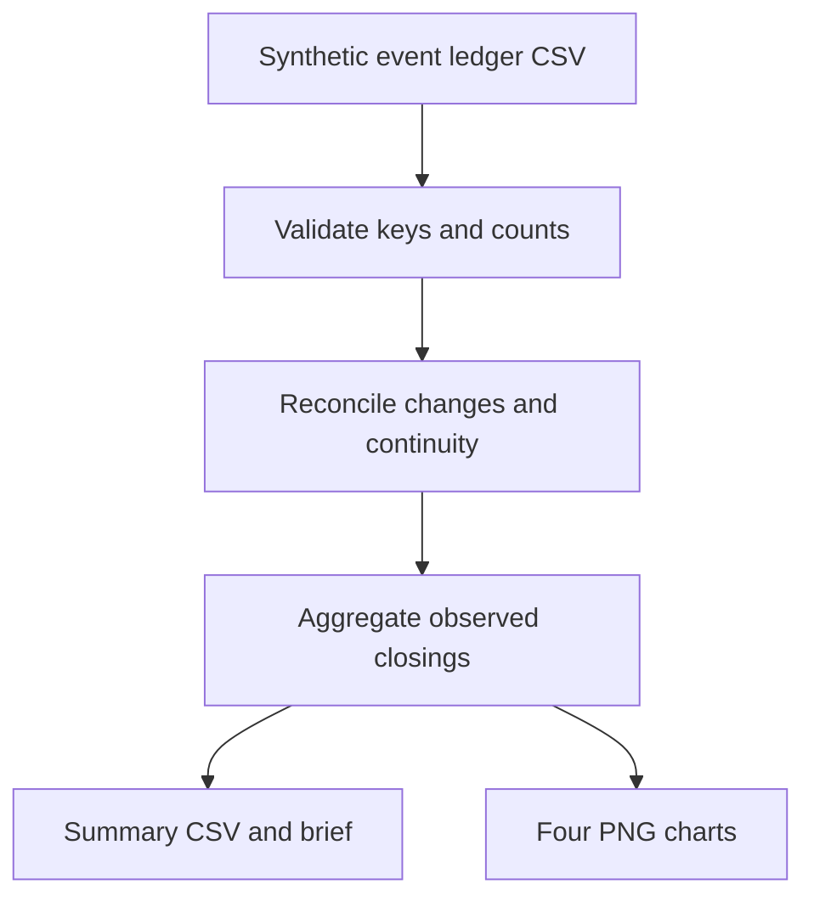

# Design and validation

## Independent workflow

The input is a long-form CSV event ledger. The program checks counts and transitions, aggregates the independently observed closing records, and creates CSV, Markdown, and PNG outputs. It does not require an ILS export, a monthly workbook template, a style workbook, row copying, or vendor-specific fields.

## Missingness and trust

- A blank count becomes `None`, not zero. The October 2025 kit count of zero remains a numeric zero.
- The time grid is constructed from `--start` and `--months`. Each community/family combination is expected in every month; a missing row is reported.
- A system closing total is available only when every expected closing count for that month is reported. April 2026 is left blank in the CSV and plotted with a gap.
- If the *latest* system closing total is incomplete, the board-view command stops before writing output files, so current rankings cannot quietly exclude a community. A past gap can remain visible in a trend.
- A change field can be missing even if an observed closing count exists. February 2026 illustrates this; its withdrawal flow is not plotted, but its observed total remains present and the month is provisional.
- When all change fields exist, closing is reconciled. The 19-item September difference is flagged; the observed total remains visible with a provisional marker.
- Consecutive available monthly closing and opening counts are checked for continuity. A genuine unreported month is not interpolated.
- Systemwide transfers in and out must balance when all transfer fields are available.

## Limits

The code infers the participating communities and collection families from the supplied rows. An external authoritative roster would be necessary to detect a community that never appears in the input at all. Counts are not circulation, cost, age, or demand measures. The example includes a controlled fictional data generator; its observed closing figures should not be mistaken for real measurements.

The charts use a narrowed, explicitly labeled trend axis to make changes visible. Four family segments on the mix chart are mutually exclusive. All figures are static PNGs so they can be placed in a report without an interactive hosting stack.
