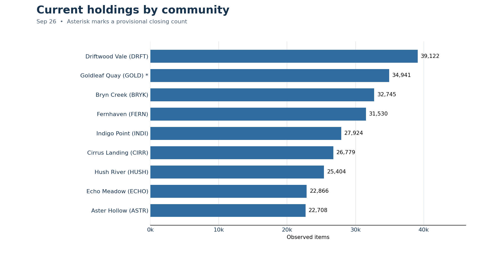
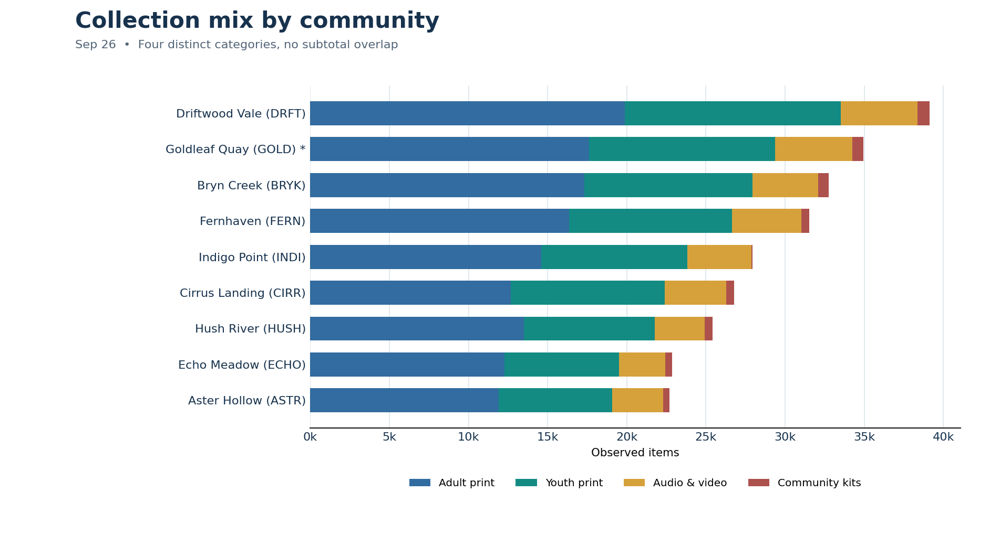

# Fictional collection-change brief

**Period:** 2025-10 through 2026-09  
**Scope:** 9 fictional communities and 4 collection families  
**Status:** Demonstration data, not actual library statistics

## What the latest records show

- Latest observed holdings: **264,019** (provisional).
- Previous month: **263,549**; change: **+470** items.
- Months without a defensible system total: **2026-04**.
- These are inventory counts, not circulation, demand, use, or collection quality measures.

## Data quality for a board reader

- **2026-04:** no system total is plotted because ECHO has missing closing counts.
- **2026-02, CIRR/audio_video:** a change field is missing (withdrawal_log_unavailable); the observed closing count remains available.
- **2026-09, GOLD/youth_print:** reconciliation pending. Observed 11,770; expected 11,751; difference +19.

The latest system total includes all observed closing counts, including any provisional count identified above. Investigate discrepancies before treating it as final.

## Charts

## Reading the files

`monthly_system.csv` includes blanks for totals that cannot be calculated. `quality_issues.csv` lists each validation finding. `current_communities.csv` supplies observed community totals and status. A blank CSV cell means **unknown**, while `0` means a reported zero.
